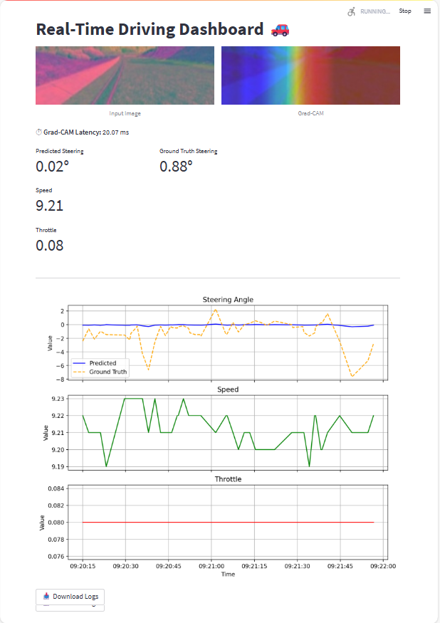

🚗 Self-Driving Car with Udacity Simulator & Deep Neural Networks 🌟

Welcome to an exciting end-to-end self-driving car project! This repository powers a virtual car in Udacity's simulator using a PyTorch-based NVIDIA-inspired convolutional neural network (CNN) trained via behavioral cloning. With real-time inference, Grad-CAM visualizations for explainability, and a sleek Streamlit dashboard, you can watch your car navigate autonomously while monitoring key metrics! 🛠️

## ✨ Features

- **Training Pipeline** 📊: Processes simulator data (images + steering angles) with robust augmentation.
- **NVIDIA CNN Model** 🧠: Predicts steering angles with a PyTorch-based deep learning model.
- **Grad-CAM Visualizations** 🔍: Highlights critical image regions for model decisions.
- **Real-Time Dashboard** 📈: Streamlit UI with SocketIO for live updates of steering, speed, throttle, and visuals.
- **Logging & Downloads** 💾: Saves driving logs (`logs.csv`) and Grad-CAM latencies (`gradcam_times.csv`) with downloadable reports.

## 🎥 Demo

\


## 🛠️ Requirements

- **Python**: 3.8+ (tested on 3.12.3 for dashboard) 🐍
- **Udacity Simulator**: Download from Udacity's GitHub 🚘
- **Hardware**: CPU (GPU recommended for faster training/inference) 💻

### 📦 Dependencies

Create a `requirements.txt` file with:

```
torch
torchvision
numpy
opencv-python
matplotlib
pandas
streamlit
socketio
eventlet
flask
pytorch-grad-cam
pillow
imgaug
scikit-learn
```

Install with:

```bash
pip install -r requirements.txt
```

## 📂 Project Structure

- `training_using_torch.ipynb`: Jupyter notebook for data loading, preprocessing, augmentation, training, and saving `model_torch.pth`. 📓
- `run_dashboard.py`: Runs the SocketIO server and Streamlit dashboard for real-time testing. 🌐
- `data/`: Stores simulator data (`driving_log.csv` and `IMG/` folder). *Generate this using the simulator.* 📁
- `model_torch.pth`: Trained model weights (created post-training). 🏋️
- `logs.csv`: Logs steering, speed, and throttle during simulation. 📜
- `gradcam_times.csv`: Tracks Grad-CAM computation times. ⏱️

## 🚀 Setup and Usage

### 1. Record Training Data 🎮

1. Launch the Udacity simulator in **Training Mode**. 🚗
2. Drive manually to capture images and driving data.
3. Save to a `data/` folder with `driving_log.csv` and `IMG/` subfolder.

### 2. Train the Model 🧠

1. Open `training_using_torch.ipynb` in Jupyter Notebook or Lab. 📓
2. Run cells to:
   - Load and preprocess data (crop, YUV conversion, Gaussian blur, resize to 200x66).
   - Augment data (flipping, brightness adjustments with imgaug).
   - Split into train/test sets.
   - Train the NVIDIA CNN model.
   - Save as `model_torch.pth`.
3. Key hyperparameters:
   - **Batch size**: 128
   - **Epochs**: 10
   - **Optimizer**: Adam
   - **Loss**: Mean Squared Error (MSE)

### 3. Run the Dashboard & Test 🚘

1. Ensure `model_torch.pth` is in the project root.

2. Open the **Udacity simulator** in **Autonomous Mode**. 🕹️

3. Run the dashboard:

   ```bash
   python run_dashboard.py
   ```

   - Starts a SocketIO server (port 4567) and Streamlit app (`http://localhost:8501`). 🌐

4. In the simulator, connect to `ws://localhost:4567`.

5. Watch the car drive autonomously and monitor the Streamlit dashboard:

   - Live input image and Grad-CAM heatmap. 🖼️
   - Real-time steering angle, speed, throttle, and latency metrics. 📏
   - Interactive plots of recent data (updated every 2 seconds). 📈
   - Download `steering_logs.csv` for analysis. 💾

### 📝 Logging

- **Files**:
  - `logs.csv`: Timestamp, steering, speed, throttle.
  - `gradcam_times.csv`: Grad-CAM latency.
- **Frequency**: Logs every 5 telemetry updates.
- **Visualization**: Plots last 50 entries using a deque buffer. 📊

## 🧬 Model Architecture

The NVIDIA-inspired CNN processes 200x66x3 images:

- 5 convolutional layers with ELU activations.
- Dropout (0.5) for regularization.
- Fully connected layers: 64*1*18 → 100 → 50 → 10 → 1 (steering angle).
- Grad-CAM on the last convolutional layer for visualizations.

```python
class NvidiaTorchModel(nn.Module):
    def __init__(self):
        super(NvidiaTorchModel, self).__init__()
        self.model = nn.Sequential(
            nn.Conv2d(3, 24, kernel_size=5, stride=2),
            nn.ELU(),
            # ... (full details in run_dashboard.py)
            nn.Linear(10, 1)
        )
    def forward(self, x):
        return self.model(x)
```

## 🔧 Troubleshooting

- **Simulator Connection Failed** 🔌: Ensure port 4567 is open. Check for "Simulator connected" in console.
- **Model Not Loading** 🚫: Verify `model_torch.pth` exists and paths are correct.
- **High Latency** ⏳: Use GPU with `torch.device('cuda')` if available.
- **Data Issues** 📂: Check `driving_log.csv` for correct columns and image paths.
- **Streamlit Errors** ❗: Test with `streamlit hello`.

## 🤝 Contributing

Love to see your ideas! Fork the repo, enhance the model, dashboard, or augmentation, and submit a pull request. 🌟

## 🙌 Acknowledgments

- Udacity Self-Driving Car Nanodegree. 📚
- NVIDIA's End to End Learning for Self-Driving Cars. 📄
- Libraries: PyTorch, Streamlit, pytorch-grad-cam. 🛠️

## 📜 License

MIT License. See `LICENSE` file for details. 🖋️
